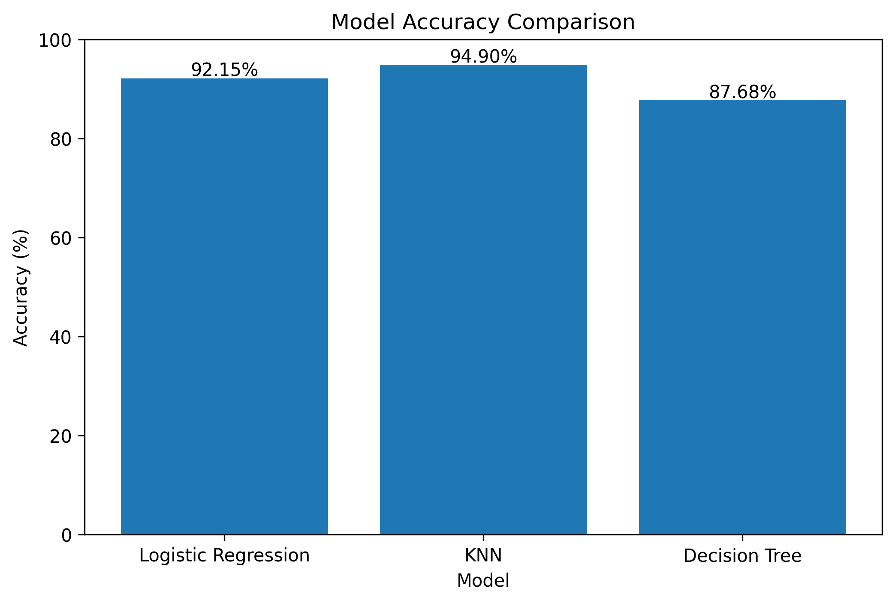

# MNIST Digit Recognizer

A machine learning project that compares classical ML models for handwritten digit recognition using the MNIST dataset.

The goal is to build the project from scratch, understand preprocessing, train multiple models, evaluate them, and compare their performance.

---

## Project Pipeline

| Step | Description |
|---|---|
| 1 | Load MNIST dataset |
| 2 | Visualize sample handwritten digits |
| 3 | Normalize pixel values |
| 4 | Split data into train and test sets |
| 5 | Train Logistic Regression |
| 6 | Train K-Nearest Neighbors |
| 7 | Train Decision Tree |
| 8 | Compare models using accuracy, classification reports, confusion matrices, and wrong predictions |

---

## Dataset

| Property | Value |
|---|---|
| Source | `sklearn.datasets.fetch_openml('mnist_784', version=1, as_frame=True)` |
| Total Samples | 70,000 |
| Features | 784 pixel values |
| Image Size | 28 x 28 |
| Classes | Digits 0 to 9 |

---

## Preprocessing

The following preprocessing steps were applied:

- Loaded the MNIST dataset using `fetch_openml`
- Visualized sample handwritten digits
- Normalized pixel values using `X = X / 255.0`
- Converted labels to integer format
- Used stratified train-test split to preserve class distribution

---

## Train-Test Split

| Dataset | Shape |
|---|---|
| X_train | 56,000 x 784 |
| X_test | 14,000 x 784 |
| y_train | 56,000 |
| y_test | 14,000 |

---

## Models Implemented

| Model | Type | Purpose |
|---|---|---|
| Logistic Regression | Linear Model | Strong baseline classifier |
| K-Nearest Neighbors | Distance-Based Model | Compares images based on similarity |
| Decision Tree Classifier | Tree-Based Model | Learns non-linear decision rules |

---

## Model Results

| Rank | Model | Test Setup | Accuracy |
|---|---|---|---|
| 1 | KNN, k=3 | 10,000 train samples, 2,000 test samples | 94.90% |
| 2 | Logistic Regression | Full test set of 14,000 images | 92.15% |
| 3 | Decision Tree | Full test set of 14,000 images | 87.69% |

---

## Accuracy Leaderboard

| Model | Accuracy | Visual |
|---|---:|---|
| KNN | 94.90% | ████████████████████ |
| Logistic Regression | 92.15% | ███████████████████ |
| Decision Tree | 87.69% | ██████████████████ |

---

## Accuracy Comparison Chart

---

## KNN Hyperparameter Results

| K Value | Accuracy |
|---|---|
| 1 | 95.60% |
| 3 | 94.90% |
| 5 | 94.80% |
| 7 | 94.05% |

The KNN model performed best when `k = 1`, but `k = 3` was used as the main KNN model because it gives strong performance while reducing sensitivity to individual noisy samples.

---

## Decision Tree Results

The Decision Tree Classifier achieved an accuracy of **87.69%** on the full test set of 14,000 images.

### Classification Report Summary

| Digit Group | Digits |
|---|---|
| Stronger Digits | 0, 1, 6, 7 |
| Weaker Digits | 5, 8, 9, 3 |

The model performed better on digits with clearer structures, such as **0** and **1**.  
It struggled more with visually similar digits such as **5**, **8**, **9**, and **3**.

---

## Error Analysis

The notebook includes:

- Classification reports
- Confusion matrices
- Wrong prediction visualizations
- Model comparison table
- Accuracy bar chart

These help identify which digits are commonly confused and where each model makes mistakes.

---

## Key Learnings

- MNIST images can be represented as 784-dimensional feature vectors.
- Normalization improves training and distance-based comparison.
- Logistic Regression is a strong and efficient baseline for multiclass classification.
- KNN performs very well on MNIST but becomes slower as dataset size increases.
- Decision Trees can capture non-linear rules but may overfit on image data.
- Confusion matrices and wrong prediction plots are useful for model interpretation.

---

## Final Conclusion

In this project, three classical machine learning models were trained and compared on the MNIST handwritten digit recognition task.

KNN achieved the highest accuracy of **94.90%**, but it was evaluated on a smaller test subset because prediction is computationally slower. Logistic Regression achieved **92.15%** accuracy on the full test set, making it the strongest full-dataset baseline. Decision Tree achieved **87.69%** accuracy and helped demonstrate how a non-linear tree-based model performs on image classification.

Overall, this project shows that classical machine learning models can perform well on handwritten digit recognition while also highlighting trade-offs between accuracy, speed, and model complexity.

---

## Next Steps

- Test custom handwritten digit images
- Try Random Forest Classifier
- Try Support Vector Machine
- Try PCA for dimensionality reduction
- Build a simple web interface for digit prediction
- Save trained models for reuse
